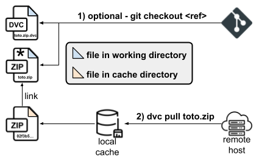
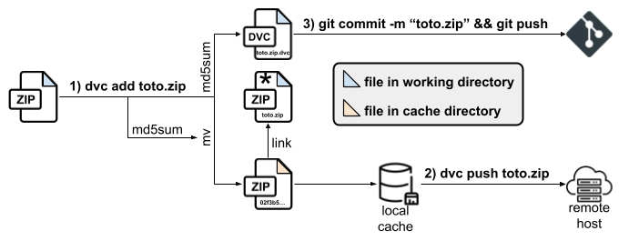

# SCIL Data Registry

Welcome to **SCIL Data**, a DVC driven data registry for SCIL databases. It provides datasets for process validation and benchmarking, educational purposes, and more. The registry uses a **ZIP** archive based packaging approach and version them through
**DVC** (Data Version Control). The data itself is stored remotely, while the registry structure and metadata are stored in this repository.

## Usage

There 2 mainstream ways of accessing the data in the registry :

1. Using the [SCIL public distribution endpoint](https://scil.usherbrooke.ca/scil_test_data/dvc-store/) with a compatible HTTP client (curl, wget). On that endpoint, in the `files/md5`, you'll find several datasets organized using **md5sum** as file names (`0f/0f3c7c6bdc9a2f6d1f9c4b3e5e6e8e7` for example), each file related to some data in this repository. To find the `md5sum` for a specific file in a dataset, look for the `outs.md5` field in `.dvc` files contained in this repository.

2. Using [DVC](https://pypi.org/project/dvc/). For it, you need to clone this repository, so you have access to the `.dvc` files tracked here. Then, you can use `dvc pull` for a whole download of the database, or `dvc pull -R data/<folder>` to download a specific dataset (also works with dataset's subfolders).

   

   > [!WARNING]
   > This repository configures **DVC** to use *symbolic links* to a local data cache when pulling data. Make sure your system or use-case supports them, or change the `cache.type` setting in `.dvc/config` to `hardlink` or `copy` before pulling any data.

## Upgrade datasets

All datasets under`data` use archives to distribute their content through DVC. Some of them also version the archive content to DVC, and will contain multiple subfolders, aside an `achives` folder for distribution. In any case, upgrading the DVC endpoint requires **DVC** and some authentication.



### Dev installation

You'll need an up-to-date version of **Python** (3.8+) and **pip** installed on your system. With it, install **Hatch** if you don't have it already :

```
pip install hatch
```

Then, create and enter the development environment with the following commands :

```
hatch env create
hatch shell
```

> [!NOTE]
> This will download all required dependencies for development, including **DVC**.

### Authentication

The default hatch environment does not give write access to the registry. This interaction is limited to `ssh` access to the remote DVC storage, for security. This mean you need direct access to the remote DVC storage through `ssh`.

1. Install the following package :

   ```
   pip install "dvc[ssh]"
   ```

   > [!IMPORTANT]
   > After this, if you already have a `ssh` access key to your server, skip to step 3.

2. Create an access key for the server that will host the DVC data. Replace `<user>`, `<host>` and `<remote url>` with your information :
   ```
   USER=<user>
   HOST=<host>
   REMOTE_URL=<remote url> or <host>
   ssh-keygen -q -f neurogister.keyfile -N "" -C "$USER@$HOST"
   ssh-copy-id -i neurogister.keyfile.pub $USER@$REMOTE_URL
   cp neurogister.keyfile ~/.ssh/.
   cp neurogister.keyfile.pub ~/.ssh/.
   ```

3. Edit the content of `.dvc/config.local` to add your authentication information. Replace `<ssh endpoint>`, `<private keyfile>` and `<user>` with your connection information :
   ```
   ['remote "neurogister"']
       url = ssh://<ssh endpoint>:/var/www/scil_test_data/dvc-store
       keyfile = <private keyfile>
       user = <user>
   ```

   > [!NOTE]
   > The `config.local` file is ignored by git, so your authentication information will not be shared with others by accident through it.

> [!WARNING]
> For any operation below, make sure the content on the **DVC** remote has been synced correctly. **It is bound to the content of the `.dvc` files, at the version you have currently**. Either perform a scoped `dvc pull -R data/<dataset folder>` or a full `dvc pull` to ensure you have the latest content.

### Upgrade to an archive-only dataset

1. Move to the dataset containing folder and **unzip** the archive :

   ```
   cd data/<dataset folder>
   unzip <archive name>.zip -d .
   ```

2. Modify the content of the newly extracted folder as needed.

3. Update the archive content :

   ```
   zip -r <archive name>.zip <archive name>
   ```

4. Update the archive tracking in **DVC** :

   ```
   dvc add <archive name>.zip
   dvc push <archive name>.zip
   ```

5. Update the tracking in **git** :

   ```
   git add .
   git commit -m "Update <dataset folder> to version <new version>"
   git push
   ```

### Upgrade to a fully versioned dataset

> [!NOTE]
> A fully versionned dataset should have all files indexed to **DVC**, so you can edit the dataset content directly and update the archives, without some syncing and unpacking operations.

1. Move to the specific dataset folder you want to edit and upgrade the files :

    ```
    cd data/<dataset folder>/<version folder>
    # Edit files as needed
    ```

    > [!IMPORTANT]
    > If you need to **edit in place** (not a simple replacement), you'll need to first use `dvc pull .` to sync the files locally.

2. Update the tracking in **DVC** :

   ```
   dvc add .
   dvc push
   ```

3. Update the archive content linked to the dataset :

   ```
   cd ..
   zip -ru archives/<dataset folder>.zip <dataset folder>
   ```

4. Follow the steps 4 and 5 of the previous section to update the archive tracking in **DVC** and **git**.

### New dataset

For a new dataset, the procedures are quite similar. Just make sure you don't commit the data you want to track with **DVC** to **git** ! The **only requirement is** that your dataset root name and archive name exactly match.
